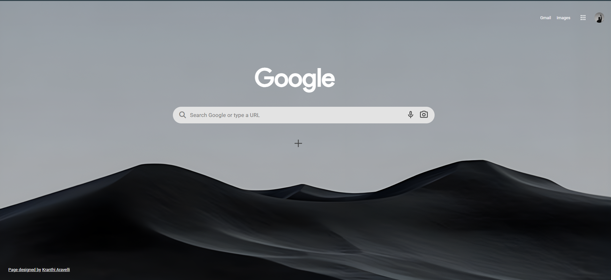

# Google Clone Website

A simple clone of the Google Home Page created using HTML and CSS.

This was my first attempt at cloning a real-world website as a beginner frontend developer. I tried recreating the layout, positioning, Google logo section, search bar, buttons, and background styling as closely as possible to the original Google homepage.

Although the project is not responsive, it helped me understand webpage structure, alignment, spacing, and basic frontend design principles.

---

## Preview

Add a screenshot of your project here.

Example:

---

## Features

* Google homepage inspired UI
* Search bar design
* Navigation links
* Styled buttons
* Background image implementation
* Clean layout structure

---

## Built With

* HTML5
* CSS3

---

## What I Learned

While building this project, I learned:

* Basic webpage structuring
* CSS positioning
* Flexbox alignment
* Spacing and layout management
* Recreating real-world website interfaces
* Improving UI observation skills

---

## Note

This project is currently **not responsive** and was created mainly for learning and practice purposes during the beginning of my frontend development journey.

---

## How to Run the Project

1. Download or clone the repository
2. Open the project folder
3. Run the `index.html` file in your browser

---

## Future Improvements

* Make the website responsive
* Improve accessibility
* Add dark mode
* Add search functionality using JavaScript

---

## Author

Kranthi Kumar

GitHub: https://github.com/kranthiaravelli/

---

## Live Demo

Not Yet Deployed
